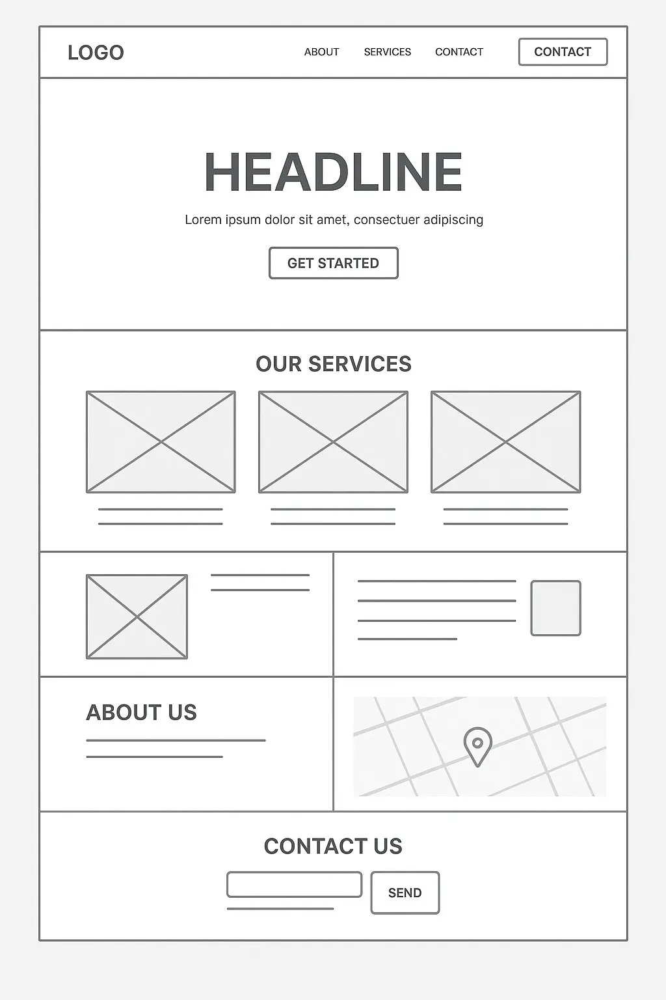

# A Magyar Légierő Története Projekt
 Magyar péter megválasztásával bejöttek a dollár milliók és kervényeztek több új frissített történelmi weboldalt. Ez a magyar légierő történelmileg átfogó weboldala lesz--

Ez a digitális archívum és ismeretterjesztő felület egyszerre szolgál edukációs bázisként az új generációk számára, és tiszteletteljes megemlékezésként mindazok előtt, akik az elmúlt több mint száz évben a magyar felhők felett szolgáltak.

## Látványterv

https://www.raf.mod.uk/what-we-do/our-history/

## Tartalom

[Ezzel a tartalommal terveztük feltölteni](content.md)

## Oldaltérkép

- Főoldal
- A légierő történelme
- Járművek
- Galéria
- Hírek
- Elérhetőségeink
- Csatlakozz a légierőhöz!

## Vázszerkezetrajz

## A projektet magyarország kormánya támogatta
